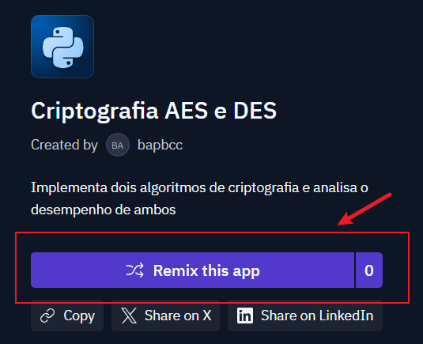
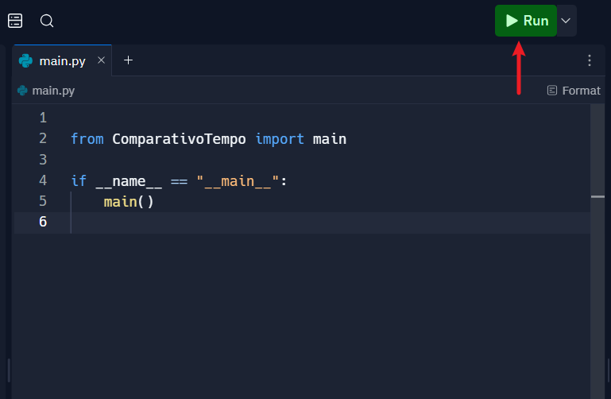

# Algoritmos de criptografia simétricos

A criptografia desempenha um papel fundamental na segurança da informação, garantindo a confidencialidade, integridade e autenticidade dos dados em sistemas computacionais. Dentre as diversas técnicas criptográficas, os algoritmos de criptografia simétrica destacam-se por sua eficiência e ampla aplicação em cenários que exigem proteção de dados sensíveis. Neste contexto, o Advanced Encryption Standard (AES) e o Data Encryption Standard (DES) emergem como dois dos algoritmos mais relevantes e utilizados no âmbito da criptografia simétrica.

Este trabalho tem como objetivo explorar e comparar os algoritmos AES e DES, abordando seus princípios de funcionamento, estruturas de dados envolvidas, complexidade computacional e aplicações práticas. Por fim, serão apresentados exemplos de implementação e análise de desempenho, visando proporcionar uma compreensão abrangente sobre o tema e sua relevância no cenário atual de segurança da informação.&#x20;

## Tecnologias Utilizadas

- Python 3.10

## Instruções para execução

O código está hospedado online no site Replit, para acessá-lo clique no link: [https://replit.com/@bapbcc/Criptografia-AES-e-DES](https://replit.com/@bapbcc/Criptografia-AES-e-DES).

Uma vez na página inicial você deve clicar em "Remix this app" e logar com sua conta google - infelizmente, por serviços de hospedagem em nuvem serem raramente grátis, o login com a conta do Google se torna necessário.   

Uma vez logado, clique em "Run" para que o código execute.

